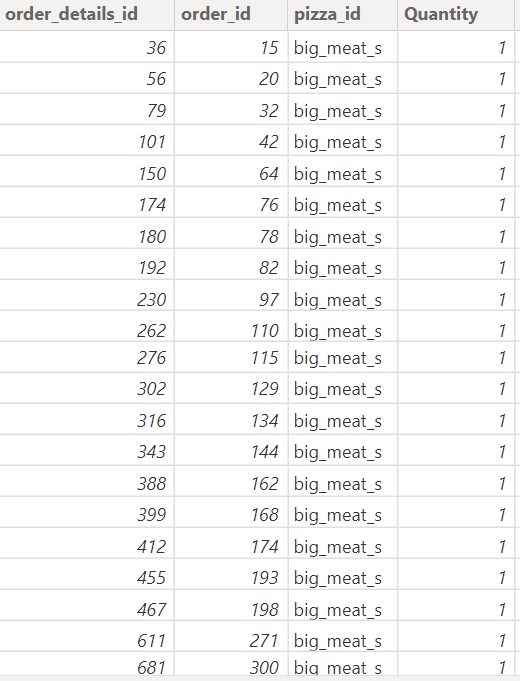

# Pizza-Sales-Report

# Introduction

This is a sales report about a particular Pizza business in 2015. This report dived deeper into understanding the overall sales trend of the business and predicted the sales trends for the subsequent years. The report explained the seasonality of the sales, How many customers are gained per day,  the pizza’s sales performance, How much money was made monthly, and peak hours for pizza sales. Power Query Editor for PowerBi was used to complete the process.

## Skills /Concepts demonstrated

- Dax functions (CALCULATE, AVERAGE, RELATED, and SUM) were used.
- Quick Measure
- Filter
- Power Query editor
- Data Modelling star schema
- Connecting slicers with the report
- Visualization charts

## Problem Statements
- How many customers do we have each day? Are there any peak hours?
- How many pizzas are typically in an order? Do we have any bestsellers?
- How much money did we make this year? Can we identify any seasonality in the sales?
- Are there any pizzas we should take off the menu, or any promotions we could leverage?

## Data Description

The Pizza dataset contains three (3)dimensional Tables ( Orders, PizzaType, and Pizzas), and one (1) fact (Order_details) Table. The order_ details contain 48,620 rows, the Orders Table has 21,350 rows, Pizza_types 32 rows, and Pizzas 96 rows. Including the date and time of each order and the pizzas served, with additional details on the type, size, category, quantity, price, and ingredients.
 
The data set was sourced from [Maven Analytics](https://www.mavenanalytics.io)

## Data Transformation

The data set was transformed using Power Query Editor for Power Bi. I changed the first row as a header to better understand each column. The relationship between the tables was established in the model view through their keys.

I noticed the following inconsistencies in the data set;

- The sales column is not present
- The hours, days, Months, and Quarter columns are not present

These missing columns are pertinent to standardizing and improving the data set for accurate analysis.

In the order_details table, four columns were provided; order_details id, order Id, pizza id, and quantity.  I created the price column using a DAX function RELATED and the Sales column by multiplying the price column by the quantity column.

**The DAX formula**

For price:

 `Price = RELATED(pizzas[price])`  **RELATED** function was used because there is a relationship between orders_details and the Pizzas table.

For Sales:

`Sales = orders_details[price]*orders_details[Quantity]`    Then, the format was changed to currency in Dollars($). Preview the image below

Before                   |      After
:-----------------------:|:--------------------------:
       |   

In the oders table , three columns was provided; **order id column, Date column, and Time column**. To improve our analysis there is a need to derived columns for the following; 

Months and Month Number,
Days and Days Number
Quarter and Quarter Number
Hours.

Before                   |      After
:-----------------------:|:--------------------------:
       |   

For example, Month name and Month Number was created from Date column in the power query editor.

**STEPS**

1. Duplicate the Date column
2. Right click on the duplicated column
3. Select transform
4. Select Month
5. Select Name of Month

For Month Number

1. Duplicate teh Date column
2. Right click on the duplicated column
3. Select Transform
4. Select Month
5. Select Month

_Repeat the same steps for Days and Quarters_

preview the Image below 👇

**Hours column is derived from Time Column**.

**STEPS**

1. Duplicate the Time column
2. Right Click on the Duplicated column
3. Select Transform
4. Select Hour
5. Select Hour

Preview the image below 👇
 
 
 
 

# Data Modelling

The model is a star schema. There are three (3) dimension tables named Orders, Pizza_type, and Pizzas and one (1) fact table named Order_details. The dimension tables are all joined to the fact table in a one-to-many relationship

# Analysis and Visualization

## The Sales Evaluation

The sales page explains the sales trend of the business and how much money was made that year.

## Customer Evaluation Page

- The customer evaluation page dive deeper to understand  how many customer do they get per day
- Which Day of the week has the highest and the least customer's orders

## Pizza Performance Evaluation

- This page shows the best performing and the leat performing Pizza
- Answer which Pizza should be takenn off Menu 
- Why consumers purchase certain Pizza sizes and ingredient type

# Conclusion 😎

- The overall Buisness trend looks promising in the subsequent years. 
- Developing this business into franchise will attract more investors and increase the popularity of the brand
- Expansion of the business will reduce the unemployment rate in the country as more skilled hands will be needed for smooth operation, efficiency, and continuity of     the business.
- More cashflow will be generated when the business size grown.

# Recommendation 

- Promotional campaigns should be targeted towards the second half of the year. Emphasis should be on September, October, and December. It is pertinent to investigate   and fix why sales decline in **ember months, December especially**. 

- The Staff should be compensated during the peak months of sales.

- More staffs should be on duty on Friday to ensure fast customer delivery and efficient operations.

- Offer discounted price for the most ordered pizza type and sizes in order to encourage more consumers to consider their favorite Pizza instead of eating out or         cooking on Sundays.

- Organize a **local games contest** to attract more customers to the store on Sunday.

_ Introduce more variety of sizes for the Brie Carre. Also, run a promotional campaign Ads using the medicinal benefits of the ingredient as USP.

